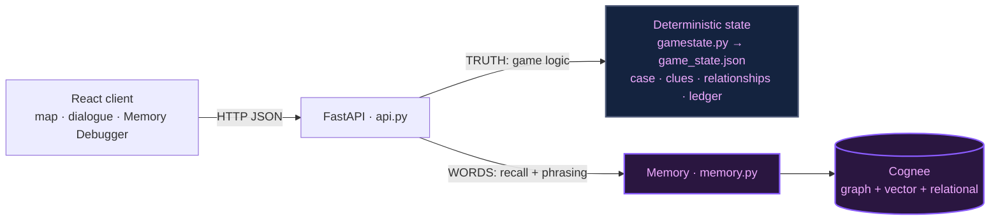
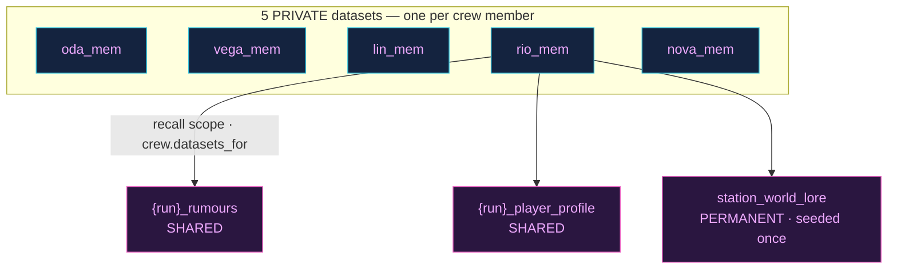
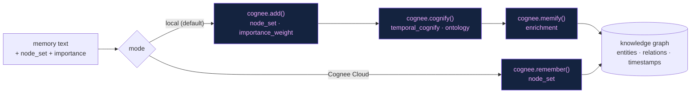
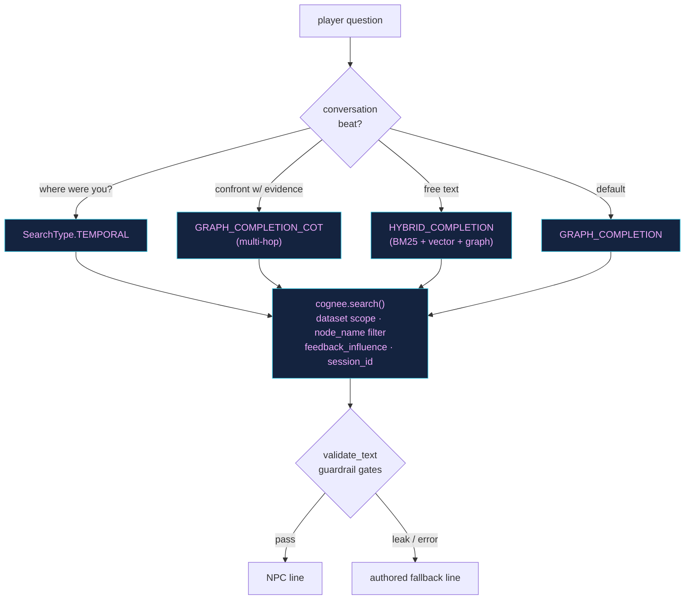
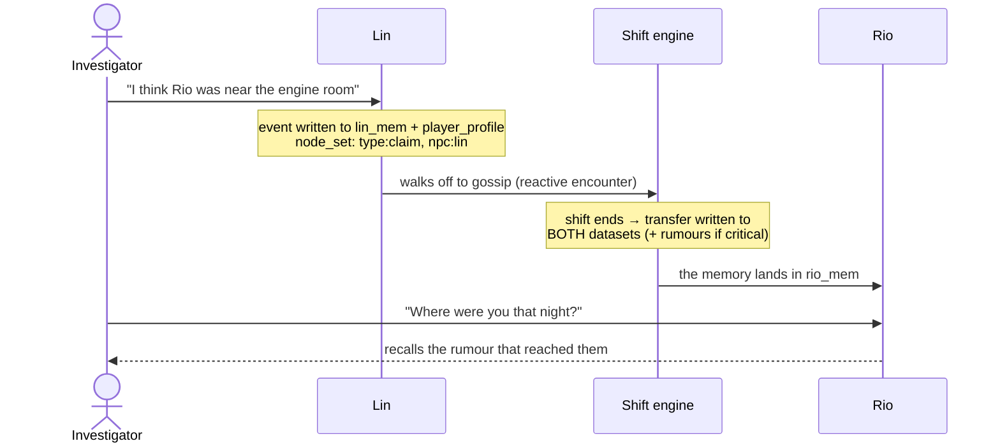
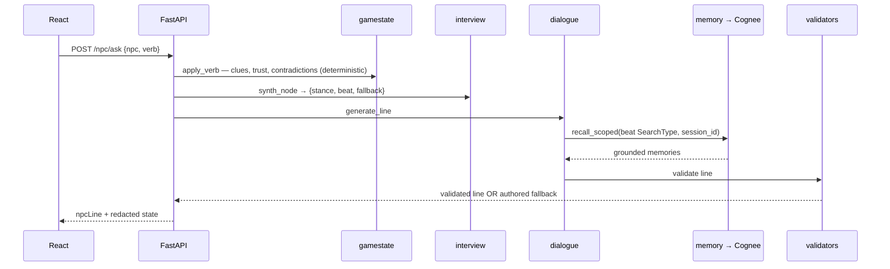
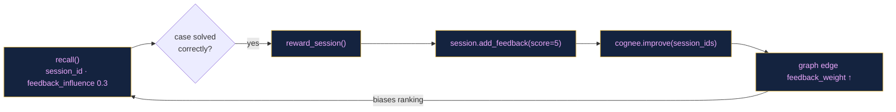
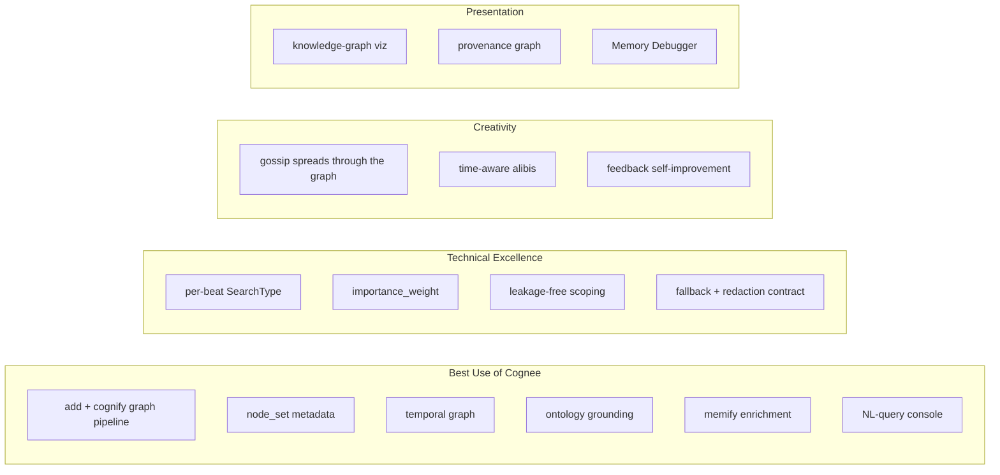

# DEAD AIR — Presentation Diagrams

Slide-ready diagrams of the memory system and its flows, in **Mermaid** (renders
live on GitHub). To use in a deck: open this file on GitHub and screenshot, or
paste any block into <https://mermaid.live> and **Export → PNG/SVG**. Slidev,
Marp and reveal.js render Mermaid natively.

Each diagram has a **slide title** and a **talking point** — use them as-is.

---

## 1 · The big idea — two sources of truth
**Slide:** "Memory changes the dialogue — not the game logic."

**Talking point:** the LLM only *phrases* lines. What's true, which clues drop,
and who the culprit is are all deterministic — so a hallucination can never
change game truth or leak the mystery.

---

## 2 · Memory topology — leakage-free dataset scoping
**Slide:** "Each crewmate remembers only their own dataset → five different answers."

**Talking point:** `recall(datasets=[...])` is leakage-free by construction. Rio
sees only `rio_mem` + the shared datasets — never Oda's private memories. That
isolation is *why* the same question gets divergent answers. 7 run-scoped
datasets per game, wiped and reseeded each run.

---

## 3 · Write path — building the knowledge graph
**Slide:** "Every memory is tagged, timed, and ontology-grounded as it's stored."

**Talking point:** seeds get the full pipeline (temporal + ontology + enrichment);
per-turn gossip uses a lighter `cognify` for speed/quota. `node_set` tags
(`npc:rio`, `shift:1`, `type:gossip`, `truth:secondhand`) make the store a real
hybrid graph-vector index.

---

## 4 · Read path — the right SearchType per question
**Slide:** "Different questions want different retrieval — routed to the right graph search."

**Talking point:** a whereabouts question runs time-aware retrieval; a
confrontation runs multi-hop chain-of-thought over the graph. Any failure or
locked-fact leak falls back to an authored line — story truth never depends on
the model.

---

## 5 · The showcase — a memory travels the station
**Slide:** "Gossip is a real graph write — watch a rumour reach someone you never told."

**Talking point:** you never spoke to Rio about this — but because Lin (a gossip)
passed it on, the memory physically moved into Rio's dataset and now colours what
Rio recalls. The Memory Debugger shows it happen live.

---

## 6 · One conversation turn — end to end
**Slide:** "Deterministic effects first, then memory-grounded words."

**Talking point:** clue grants and relationship changes happen in Python before
the model is ever called. The model's only job is phrasing — behind a validator
and a fallback.

---

## 7 · Self-improving memory — the feedback loop
**Slide:** "Solve the case → the memory graph learns which recalls were good."

**Talking point:** feedback scores flow into graph edge weights, which
`feedback_influence` then uses to rank future recall — memory that optimises
from outcomes. (Gated behind `NPCMEM_FEEDBACK_LEARN` because `improve()` is
LLM-heavy.)

---

## 8 · How we use Cognee → judging criteria
**Slide:** "Every Cognee lifecycle API, mapped to a game system."

**Talking point:** the build touches the whole Cognee memory lifecycle —
`add · cognify · memify · search · improve · visualize` — each wired to a concrete
gameplay purpose, not bolted on.

---

### Rendering notes
- **GitHub:** renders all of these inline — just open the file.
- **Slides:** paste a block into <https://mermaid.live>, tweak the theme if you
  like, then Export PNG/SVG. The `classDef` colours match a dark deck; delete the
  `classDef`/`class` lines for a plain black-on-white version.
- **Live in a deck:** Slidev / Marp / reveal.js (with the mermaid plugin) render
  these directly from the fenced mermaid code blocks.
